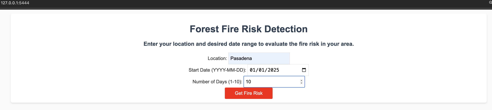
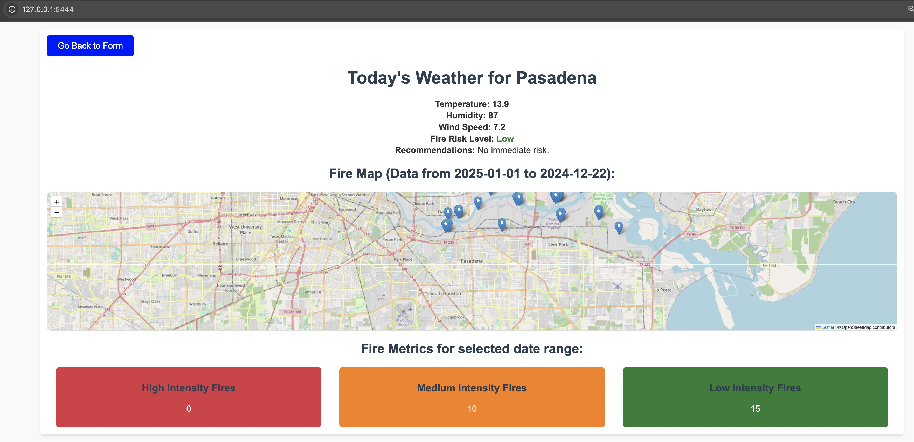

# Wildfire Watcher 🔥

A web application to detect and monitor forest fire risks using weather and fire data. This app leverages OpenAI's GPT for risk analysis and NASA's FIRMS API for fire data.

## Features
- **Forest Fire Risk Detection**: Analyze the risk level of forest fires based on weather conditions.
- **Dynamic Fire Maps**: Visualize fire data within a 10-mile radius of a given location.
- **Historical Data**: View fire activity and key metrics (brightness, risk level) for the past 10 days.

## Tech Stack
- **Backend**: Python (Flask)
- **Frontend**: HTML/CSS (Bootstrap/Tailwind)
- **APIs**:
  - OpenAI API (for risk analysis)
  - NASA FIRMS API (for fire data)
  - Weather API (for location-specific weather data)

## Installation
1. Clone the repository:
   ```bash
    git clone git@github.com:KK365-learn/wildfire-watcher.git
   ```
2. Navigate to the project directory:
    ```bash
    cd wildfire-watcher
    ```
3. Install dependencies:
    ```bash
    pip install -r requirements.txt
    ```
4. Set up environment variables:
  Create a .env file and add your API keys:
  Edit
    ```bash
    vi .env 
    ```
    add these contents
    ```bash
      OPENAI_API_KEY=<your_openai_api_key>
      MAP_KEY=<your_nasa_firms_api_key>
      WEATHER_API_KEY=<Weather_api_key>
    ```
    ```html
    OPEN API key  : https://platform.openai.com/
    Map key       : https://firms.modaps.eosdis.nasa.gov/api/
    Weather Key   : https://www.weatherapi.com/
    ```
5. Run the app:
  ```bash
  python app.py
  ```

Usage
  1. Enter a location, start date, and number of days to analyze.
  2. View risk levels, fire activity, and recommendations.

Screenshots
  1. Home Page:
    
    
  2. Results Page:
    

